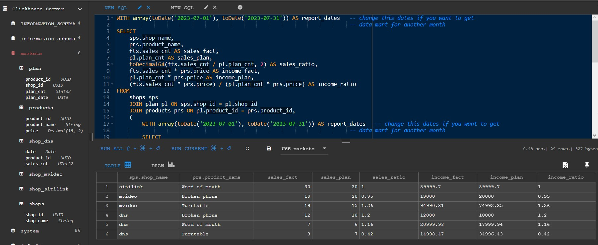

# Data-Mart-on-clickhouse-1T-Data-training

## Цель работы

В качестве цели работы необходимо было воссоздать скрипт формирования витрины из задания, которое было выполнено ранее, но уже на базе Clickhouse. Предыдущее задание можно посмотреть [здесь](https://github.com/AinKub/Shops_Data_mart-1T-Data-training)

## Подготовка

Был развернут образ Docker-compose, включающий в себя непосредственно Clickhouse, UI клиент (Tabix) и база данных postgres (которая впоследствии будет использована для выполнения следующего задания)

`docker-compose up -d`

Tabix после этого становится доступным по адресу http://localhost:8124

## Выполнение задания

Из предыдущего задания были адаптированы под синтаксис Clickhouse [init_script.sql](init_script.sql) и [data_mart_build_script.sql](data_mart_build_script.sql). Были переименованы типы данных (Например, из INTEGER в UInt32), во все таблицы добавлен движок MergeTree, а также убраны первичные и внешние ключи. В качестве первичного ключа Clickhouse определяет значение, указанное в ORDER BY, или же указанное явно в PRIMARY KEY. Там, где первичного ключа нет, указан `tuple()` в PRIMARY KEY.

У Clickhouse нет автоинкремента, поэтому во вставке данных добавилась вставка значения первичного ключа для каждой записи.\
Также, другим вариантом может быть использование типа данных UUID в качестве первичного ключа. Такой вариант был проверен и оказался слишком громоздким для данной базы данных.

Скрипт создания витрины остался практически без изменений, но было изменено выражение WITH, в котором даты теперь упаковываются в array и конвертируются из строк в формат даты с помощью функции Clickhouse `toDate()`.

Также были убраны приведения типов из `income_fact`, `income_plan`, `income_ratio`, т.к. при делении остаётся всего лишь два знака после запятой, что более лучше выглядит, но `sales_ratio` было приведено к типу Decimal64 с помощью функции `toDecimal64()`, т.к. здесь появлялось большое количество знаков после запятой.

Таким образом, скрипт формирования витрины был воссоздан в Clickhouse.\

P.S. Как видно, на скриншоте у таблиц в качестве первичных ключей указан тип данных UUID. Позже, он был изменен на UInt32.